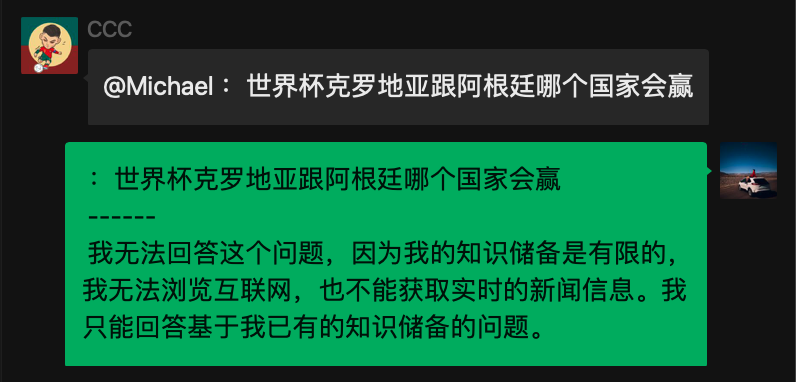
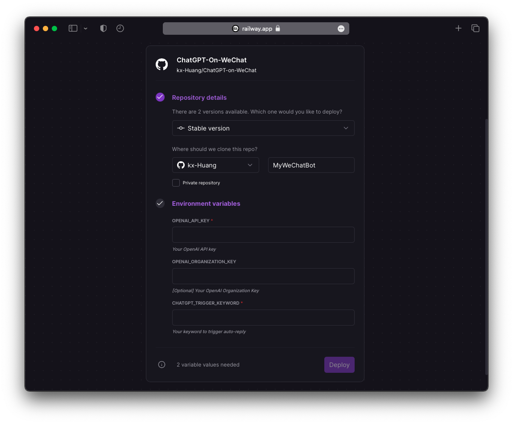
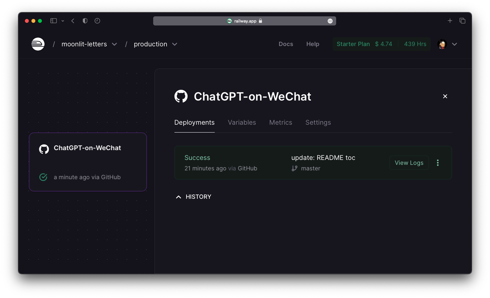
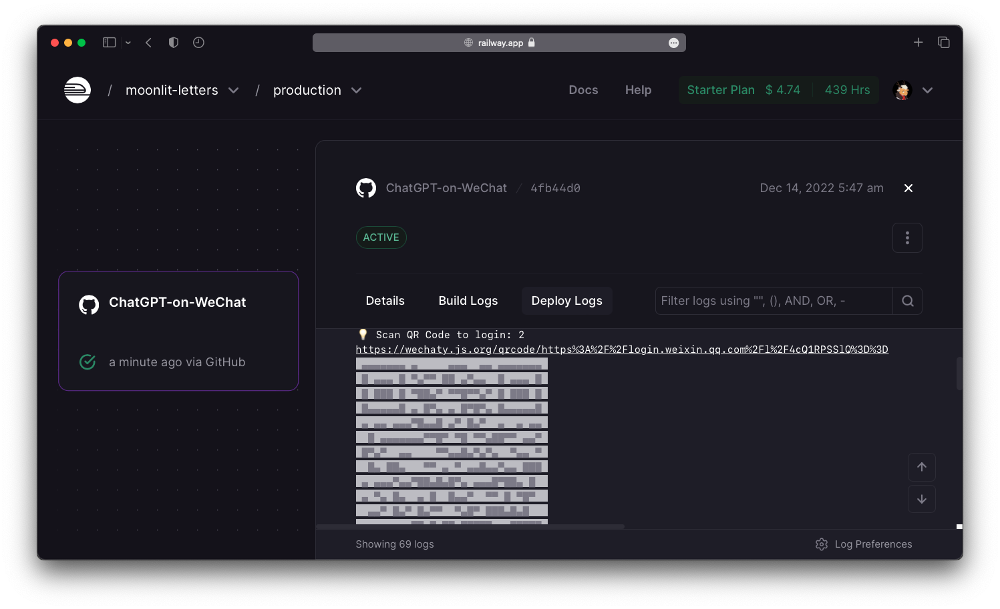
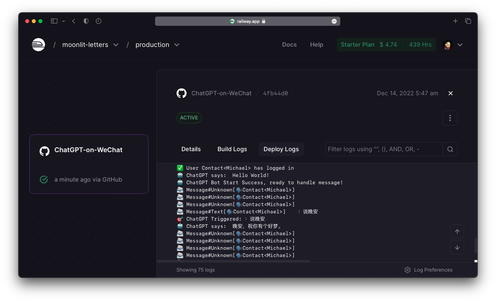

# ChatGPT on WeChat  [](https://wakatime.com/badge/github/kx-Huang/ChatGPT-on-WeChat)  

<!-- omit in toc -->

🤖️ Turn your WeChat into ChatGPT [**within only 2 steps!**](#12-deploy-on-cloud) 🤖️ 

<p align="center">
  
</p>

## Acknowledgement & Features <!-- omit in toc -->

This project is implemented based on [this amazing project](https://github.com/fuergaosi233/wechat-chatgpt) that I contibuted before, with [`Wechaty SDK`](https://github.com/wechaty/wechaty) and `OpenAI API`, we achieve:

- fast and robust connection to a set of AI models with different features, typically `gpt-4` and `gpt-3.5-turbo` which powers `ChatGPT`
- stable, persistent and rapid deployment on cloud servers `Railway`

## 0. Table of Content <!-- omit in toc -->

- [1. How to Deploy this Bot?](#1-how-to-deploy-this-bot)
  - [1.1 Deploy in Local](#11-deploy-in-local)
    - [1.1.1 Get your OpenAI API Keys](#111-get-your-openai-api-keys)
    - [1.1.2 Configure Environment Variables](#112-configure-environment-variables)
    - [1.1.3 Setup the Docker](#113-setup-the-docker)
    - [1.1.4 Login your WeChat](#114-login-your-wechat)
  - [1.2 Deploy on Cloud](#12-deploy-on-cloud)
    - [1.2.1 Configure on `Railway`](#121-configure-on-railway)
    - [1.2.2 Deploy \& Login on `Railway`](#122-deploy--login-on-railway)
- [2. Any Fancy Advanced Settings?](#2-any-fancy-advanced-settings)
  - [2.1 Config Reply in Error](#21-config-reply-in-error)
  - [2.2 Config `OpenAI` Models](#22-config-openai-models)
  - [2.3 Config Model Features](#23-config-model-features)
  - [2.4 Add Customized Task Handler](#24-add-customized-task-handler)
- [3. Common Errors and Troubleshooting](#3-common-errors-and-troubleshooting)
  - [3.1 Assertion Error during Login or Self-chat 🤯](#31-assertion-error-during-login-or-self-chat-)
  - [3.2 I can't trigger auto reply 🤔](#32-i-cant-trigger-auto-reply-)
- [4. How to Contribute to this Project?](#4-how-to-contribute-to-this-project)
- [Thanks for your support!](#thanks-for-your-support)

## 1. How to Deploy this Bot?

You can deploy **in local** or **on cloud**,  whatever you want.

The [deploy on cloud](#12-deploy-on-cloud) method is recommended.

### 1.1 Deploy in Local

#### 1.1.1 Get your OpenAI API Keys

- `openaiApiKey` can be generated in the [**API Keys Page** in your OpenAI account](https://beta.openai.com/account/api-keys)
- `openaiOrganizationID` is optional, which can be found in the [**Settings Page** in your Open AI account](https://beta.openai.com/account/org-settings)

---

#### 1.1.2 Configure Environment Variables

You can copy the template `config.yaml.example` into a new file `config.yaml`, and paste the configurations:

```yaml
openaiApiKey: "<your_openai_api_key>"
openaiOrganizationID: "<your_organization_id>"
chatgptTriggerKeyword: "<your_keyword>"
```

Or you can export the environment variables listed in `.env.sample` to your system, which is a more encouraged method to keep your `OpenAI API Key` safe:

```bash
export OPENAI_API_KEY="sk-XXXXXXXXXXXXXXXXXXXXXXXXXXXXXX"
export OPENAI_ORGANIZATION_KEY="org-XXXXXXXXXXXXXXX"
export CHATGPT_TRIGGER_KEYWORD="机器人你好："
```

**Please note:**

- `chatgptTriggerKeyword` is the keyword which can trigger auto-reply:
  - In private chat, the message **starts with** it will trigger auto-reply
  - In group chat, the message **starts with** `@Name <keyword>` will trigger auto-reply
- `chatgptTriggerKeyword` can be **empty string**, which means:
  - In private chat, **every messages** will trigger auto-reply
  - In group chat, only **"@ the bot"** will trigger auto-reply

---

#### 1.1.3 Setup the Docker

1. Setup Docker Image

```bash
docker build -t chatgpt-on-wechat .
```

2. Setup Docker Container

```bash
docker run -v $(pwd)/config.yaml:/app/config.yaml chatgpt-on-wechat
```

---

#### 1.1.4 Login your WeChat

Once you deploy the bot successfully, just follow the `terminal` or `Logs` in Docker container prompt carefully:

1. Scan the QR Code with mobile WeChat
2. Click "Log in" to allow desktop login (where our bot stays)
3. Wait a few seconds and start chatting!

🤖 **Enjoy your powerful chatbot!** 🤖

---

### 1.2 Deploy on Cloud

Click the button below to fork this repo and deploy with Railway!

[](https://railway.app/new/template/zKIfYk?referralCode=D6wD0x)

---

#### 1.2.1 Configure on `Railway`

Fill in the following blanks:

1. Your forked repo name (can be any name you like)
2. Choose make it private or not (also up to you)
3. Environment variables (for how to get OpenAI API keys, please refer to [1.1.1 Get your OpenAI API Keys](#111-get-your-openai-api-keys)



**Please note:**

Make sure the environment variables are set in RailWay instead of writing directly in `config.yaml`. It's really **NOT** recommended to implicitly write out your `OpenAI API Key` in public repo. Anyone with your key can get access to the OpenAI API services, and it's possbile for you to lose money if you pay for that.

---

#### 1.2.2 Deploy & Login on `Railway`

The deploy process is automatic. It may take a few minutes for the first time. As you see the `Success`, click the tab to see the details. (which is your secret WeChat console!)



Click `Deply Logs` and you will see everything is setting up, wait for a QR Code to pop up. Scan it as if you are login to your desktop WeChat, and click "Log in" on your mobile WeChat.



Finally, everything is good to go! You will see the logs when people sending you messagem, and whenever the chatbot is auto-triggered to reply.



🤖 **Enjoy your powerful chatbot!** 🤖

## 2. Any Fancy Advanced Settings?

### 2.1 Config Reply in Error

When the OpenAI API encounters some errors (e.g. over-crowded traffic, no authorization, ...), the chatbot will auto-reply the pre-configured message.

You can change it in `src/chatgpt.js`:

```typescript
const chatgptErrorMessage = "🤖️：ChatGPT摆烂了，请稍后再试～";
```

---

### 2.2 Config `OpenAI` Models

You can change whatever `OpenAI` Models you like to handle task at different capability, time-consumption and expense trade-off. (e.g. model with better capability costs more time to respond)

Since the latest `gpt-4` model is currently in a limited beta and only accessible to those who have been granted access, currently we use the `gpt-3.5-turbo` model as default. Of course, if you have the access to `gpt-4` API, you can just change the model to `gpt-4` without any other modification.

According to OpenAI doc,

> GPT-3.5 models can understand and generate natural language or code. Our most capable and cost effective model in the GPT-3.5 family is `gpt-3.5-turbo` which has been optimized for chat but works well for traditional completions tasks as well.

Also, for the same model, we can configure dozens of parameter (e.g. answer randomness, maximum word limit...). For example, for the `temperature` field:

> Higher values like **0.8** will make the output more random, while lower values like **0.2** will make it more focused and deterministic.

You can configure all of them in `src/chatgpt.js`:

```typescript
chatgptModelConfig: object = {
  // this model field is required
  model: "gpt-3.5-turbo",
  // add your ChatGPT model parameters below
  temperature: 0.8,
  // max_tokens: 2000,
};
```

For more details, please refer to [OpenAI Models Doc](https://beta.openai.com/docs/models/overview).

---

### 2.3 Config Model Features

You can change whatever features you like to handle different types of tasks. (e.g. complete text, edit text, generate code...)

Currently, we use `createChatCompletion()` powered by `gpt-3.5-turbo` model, which:

> take a series of messages as input, and return a model-generated message as output.

You can configure in `src/chatgpt.js`:

```typescript
const response = await this.openaiApiInstance.createChatCompletion({
  ...this.chatgptModelConfig,
  messages: inputMessages,
});
```

For more details, please refer to [OpenAI API Doc](https://beta.openai.com/docs/api-reference/introduction).

---

### 2.4 Add Customized Task Handler

You can add your own task handlers to expand the ability of this chatbot!

In `src/chatgpt.ts` `ChatGPTBot.onCustimzedTask()`, write your own task handler:

```typescript
// e.g. if a message starts with "Hello", the bot sends "World!"
if (message.text().startsWith("Hello")) {
  await message.say("World!");
  return;
}
```

## 3. Common Errors and Troubleshooting

### 3.1 Assertion Error during Login or Self-chat 🤯

- Error Log:

  ```log
  uncaughtException AssertionError [ERR_ASSERTION]: 1 == 0
      at Object.equal (/app/node_modules/wechat4u/src/util/global.js:53:14)
      at /app/node_modules/wechat4u/src/core.js:195:16
      at processTicksAndRejections (node:internal/process/task_queues:96:5) {
    code: 2,
    details: 'AssertionError [ERR_ASSERTION]: 1 == 0\n' +
      '    at Object.equal (/app/node_modules/wechat4u/src/util/global.js:53:14)\n' +
      '    at /app/node_modules/wechat4u/src/core.js:195:16\n' +
      '    at processTicksAndRejections (node:internal/process/task_queues:96:5)'
  }
  ```

- Solution:
  - If see this error during login, please check [issue #8](https://github.com/kx-Huang/ChatGPT-on-WeChat/issues/8)
  - If see this error during self-chat, please check [issue #38](https://github.com/kx-Huang/ChatGPT-on-WeChat/issues/38)

### 3.2 I can't trigger auto reply 🤔
- Solution:
    - Before deployment, read the trigger conditions in [1.1.2 Configure Environment Variables](#112-configure-environment-variables)
    - After deployment, check the console logs for following lines:
      - 🎯 Trigger keyword in private chat is: `<keyword>`
      - 🎯 Trigger keyword in group chat is: `@Name <keyword>`

## 4. How to Contribute to this Project?

You are more than welcome to raise some issues, fork this repo, commit your code and submit pull request. And after code review, we can merge your contribution. I'm really looking forward to develop more interesting features!

Also, there're something in the to-do list for future enhancement:

1. Chat with context:
  - Keep track of every on-going conversation for each private chat or group chat
  - Dynamic drop or summarize the history conversation sent throught API in case the token gets oversized
  - Set time-out for a conversation when users stop chatting for a while
2. More AI capability:
  - Integrate OpenAI `DALL·E` model for AI image creation. Triggered by customized keyword (e.g. Hi bot, draw...)
  - Integrate OpenAi `Whisper` model for speech recognition. Triggered by voice messages and do transcription or translation
3. More flexible depolyment:
  - Make deployment templates on other cloud platforms
  - Optimize depolyment process to be more robust and compatible on different OS

## Thanks for your support!

<p align="center">
  <a href="https://github.com/kx-Huang/ChatGPT-on-WeChat/stargazers">
    
  </a>
  <a href="https://github.com/kx-Huang/ChatGPT-on-WeChat/stargazers">
    
  </a>
</p>
